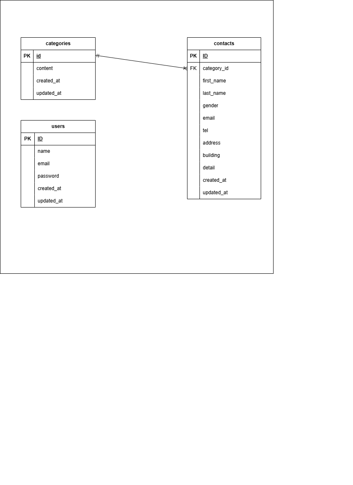

# お問い合わせフォーム

## 環境構築

### Dockerビルド

1. GitHubからリポジトリをクローン

git clone git@github.com:ami-takaoka/contact-form-test.git

2. Dockerコンテナをビルド・起動

docker-compose up -d --build

### Laravel環境構築

1. PHPコンテナに入る

docker-compose exec php bash

2.　依存関係をインストール

composer install

3.　.envファイル作成

cp .env.example .env

必要に応じて環境変数を変更

例：

DB_DATABASE=laravel_db
DB_USERNAME=laravel_user
DB_PASSWORD=laravel_pass

4.　アプリケーションキー生成

php artisan key:generate

5.　マイグレーション実行

php artisan migrate

6.  シーディング（初期データ投入）

php artisan db:seed

## 開発環境

・お問い合わせ画面：http://localhost/
・ユーザー登録：http://localhost/register
・ログイン画面：http://localhost/login
・管理画面：http://localhost/admin
・phpMyAdmin：http://localhost:8080/

## 使用技術（実行環境）
・ PHP 8.1.34
・ Laravel 8.83.8
・ jquery 3.7.1.min.js
・ MySQL MariaDB 11.8.3
・ nginx 1.21.1

## ER図

